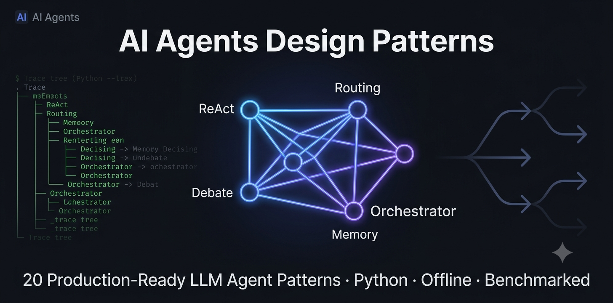

# AI Agents Design Patterns

20 production-ready LLM agent design patterns in Python, each runnable offline, benchmarked against the others, and traced step by step. From simple Prompt Chaining to multi-agent orchestration, ReAct loops, and constitutional AI. No API key required.


[](#)



---

> **Also by the author:**
> - [RAG Interview System](https://github.com/ather-techie/rag-interview-system) — Retrieval-Augmented Generation pipeline for technical interview prep
> - [AI System Design Interview](https://github.com/ather-techie/ai-system-design-interview) — Structured guides and patterns for AI/ML system design interviews

---

## Contents

- [The problem this solves](#the-problem-this-solves)
- [Quick start](#quick-start)
- [Architecture](#architecture)
- [Patterns](#patterns)
  - [Simple and Linear](#simple-and-linear)
  - [Iterative Refinement](#iterative-refinement)
  - [Tool-Using Agents](#tool-using-agents)
  - [Multi-Agent Coordination](#multi-agent-coordination)
  - [Control Flow and State](#control-flow-and-state)
- [Benchmark](#benchmark)
- [Project structure](#project-structure)
- [Contributing a pattern](#contributing-a-pattern)
- [Environment variables](#environment-variables)
- [License](#license)

<!-- Record `make demo` with asciinema + agg and save as docs/react-trace.gif, then uncomment: -->
<!--  -->

## The problem this solves

Most LLM agent design pattern repositories give you isolated tutorials with no way to compare them. They don't tell you *which pattern to reach for*, and they won't run without an API key and 30 minutes of setup.

This repo answers the question you actually have: **which agentic AI pattern fits my task, and why?** It runs the same four tasks through all 20 patterns in offline mock mode and prints a single tradeoff table, cost, latency, and reliability side by side. Every run is **traced**: you can watch each reasoning step, tool call, and observation as it happens.

## Quick start

No API key needed — every pattern runs against a deterministic offline mock:

```bash
make install                  # install the package and dev deps
make demo                     # run ReAct in mock mode — prints the trace tree
make bench                    # run all 20 patterns on 4 tasks — prints the tradeoff table
```

To run against a live model:

```bash
cp .env.example .env          # fill in ANTHROPIC_API_KEY
python patterns/07-react/example.py
```

Run any individual pattern offline:

```bash
make routing-demo             # Routing
make memory-demo              # Memory-Augmented
make debate-demo              # Debate
# … see Makefile for all per-pattern targets
```

## Architecture

Every pattern imports from `shared/` and stays provider-agnostic. Setting `USE_MOCK=1` (or leaving `ANTHROPIC_API_KEY` unset) swaps `AnthropicClient` for `MockClient` transparently — the pattern code is identical in both modes.

```
┌────────────────────────────────────┐   ┌──────────────────────┐
│        patterns/NN-name/           │   │      bench/          │
│  pattern.py · example.py · tests   │   │    compare.py        │
└──────────────┬─────────────────────┘   └──────────┬───────────┘
               │ imports                            │ imports
               └──────────────┬────────────────────┘
                    ┌──────────▼───────────┐
                    │        shared/       │
                    │  LLMClient protocol  │
                    │  ToolRegistry        │
                    │  Trace / timed_step  │
                    │  Config · Types      │
                    │  Errors · Loader     │
                    └─────┬──────────┬─────┘
                          │          │
             ┌────────────▼───┐  ┌───▼────────────────┐
             │ AnthropicClient│  │    MockClient       │
             │  (live mode)   │  │  (offline / tests)  │
             └────────────────┘  └────────────────────┘
```

## Patterns

| # | Pattern | Status | One-liner |
|---|---------|--------|-----------|
| 01 | [Prompt Chaining](patterns/01-prompt-chaining/) | ✅ | Sequential pipeline of LLM calls; each output feeds the next. |
| 02 | [Routing](patterns/02-routing/) | ✅ | Classify input, dispatch to a specialized handler. |
| 03 | [Parallelization](patterns/03-parallelization/) | ✅ | Fan out to N independent branches, fan in to one aggregate. |
| 04 | [Orchestrator-Workers](patterns/04-orchestrator-workers/) | ✅ | Orchestrator plans subtasks; workers execute; orchestrator synthesizes. |
| 05 | [Evaluator-Optimizer](patterns/05-evaluator-optimizer/) | ✅ | Generate a draft, evaluate against criteria, refine until passing. |
| 06 | [Code Execution](patterns/06-code-execution/) | ✅ | LLM writes code; a sandbox runs it; result feeds back in a loop. |
| 07 | [ReAct](patterns/07-react/) | ✅ | Interleave reasoning and acting in a bounded loop. |
| 08 | [Reflection](patterns/08-reflection/) | ✅ | Single model critiques its own draft and revises until satisfied. |
| 09 | [Plan-and-Execute](patterns/09-plan-and-execute/) | ✅ | Model builds a full plan upfront, then executes each step. |
| 10 | [Multi-Agent](patterns/10-multi-agent/) | ✅ | Supervisor selects specialized agents by role and synthesizes results. |
| 11 | [Memory](patterns/11-memory/) | ✅ | ReAct loop augmented with episodic remember / recall / forget tools. |
| 12 | [Self-Ask](patterns/12-self-ask/) | ✅ | Decompose a question into sub-questions, answer each, then synthesize. |
| 13 | [Human-in-the-Loop](patterns/13-human-in-the-loop/) | ✅ | Pause for human approval before executing checkpointed tools. |
| 14 | [State Machine](patterns/14-state-machine/) | ✅ | Route an agent through an explicit FSM; LLM picks transitions. |
| 15 | [Debate](patterns/15-debate/) | ✅ | Two agents argue for and against; a neutral judge synthesizes. |
| 16 | [Constitutional](patterns/16-constitutional/) | ✅ | Generate a draft, critique it against principles, revise until compliant. |
| 17 | [Mixture-of-Experts](patterns/17-mixture-of-experts/) | ✅ | Router selects the best specialist experts; their answers are synthesized. |
| 18 | [Speculative](patterns/18-speculative/) | ✅ | Generate N candidate answers, score each, pick the best. |
| 19 | [Event-Driven](patterns/19-event-driven/) | ✅ | Stateful reactive agent processes a stream of events. |
| 20 | [Least-to-Most](patterns/20-least-to-most/) | ✅ | Decompose a hard problem into sub-problems ordered easy to hard. |

---

### Simple and Linear

The cheapest and most predictable patterns. Reach for these first.

**[Prompt Chaining](patterns/01-prompt-chaining/)**

- The task has clear sequential sub-goals (extract → transform → format).
- Each step produces output that the next step must refine or extend.
- You want predictable structure: the pipeline shape is known up front.

```bash
USE_MOCK=1 python patterns/01-prompt-chaining/example.py
```

**[Routing](patterns/02-routing/)**

- A single classification determines which specialized handler runs.
- You have distinct task types (billing, technical, general) requiring different prompts.
- You want the cheapest possible agent baseline, one classification call plus one handler call.

```bash
make routing-demo
```

**[Parallelization](patterns/03-parallelization/)**

- You want diverse perspectives on one question (critic, optimist, analyst).
- Independent verification: run the same task N times and check for agreement.
- Throughput: wall-clock time is the slowest branch, not the sum of all branches.

```bash
USE_MOCK=1 python patterns/03-parallelization/example.py
```

**[Self-Ask](patterns/12-self-ask/)**

- Questions that require chaining facts across multiple hops.
- You want the reasoning chain to be inspectable — every sub-question and answer are recorded in the trace.
- Tasks where a single-pass response is likely to miss intermediate steps.

```bash
make self-ask-demo
```

**[Least-to-Most](patterns/20-least-to-most/)**

- A problem is too complex to solve in one shot but can be scaffolded easiest-first.
- Multi-step math or compositional reasoning where intermediate results feed into harder steps.
- Tasks where you want to verify incremental correctness before tackling the hardest part.

```bash
make least-to-most-demo
```

---

### Iterative Refinement

Improve output quality through loops. Pay in latency; gain in quality.

**[Evaluator-Optimizer](patterns/05-evaluator-optimizer/)**

- You have explicit, checkable criteria for a good output.
- The task benefits from iterative refinement rather than one-shot generation.
- Using separate generator and evaluator models reduces self-serving bias.

```bash
USE_MOCK=1 python patterns/05-evaluator-optimizer/example.py
```

**[Reflection](patterns/08-reflection/)**

- You want self-improvement without external criteria — the model decides what's good.
- The task has soft quality goals (clarity, tone, completeness) that are hard to enumerate.
- You want a single-model setup — no separate evaluator client needed.

```bash
USE_MOCK=1 python patterns/08-reflection/example.py
```

**[Constitutional](patterns/16-constitutional/)**

- You have explicit quality criteria (safety, clarity, brevity, tone) the output must satisfy.
- You want traceable, auditable improvements with one critique step per principle.
- Useful for regulated content: compliance text, customer communications, policies.

```bash
make constitutional-demo
```

---

### Tool-Using Agents

Patterns that call external APIs, run code, or query databases. Use when the model alone isn't enough.

**[Code Execution](patterns/06-code-execution/)**

- The task requires exact computation (math, data transformation, string operations).
- LLM output quality improves with real feedback from execution.
- You want verifiable results: code output is deterministic.

```bash
USE_MOCK=1 python patterns/06-code-execution/example.py
```

**[ReAct (Reason + Act)](patterns/07-react/)**

- The task needs external information or computation the model doesn't have (search, an API, a database).
- The number of steps isn't known up front — the model decides when it has enough to answer.
- You want the agent's intermediate reasoning and tool use to be inspectable.

```bash
make demo
```

**[Plan-and-Execute](patterns/09-plan-and-execute/)**

- You want to inspect or validate the plan before committing to execution.
- The task has predictable sub-steps that can be enumerated upfront.
- Execution is expensive — the plan acts as a checkpoint before committing.

```bash
USE_MOCK=1 python patterns/09-plan-and-execute/example.py
```

**[Memory-Augmented](patterns/11-memory/)**

- The agent needs to persist facts between turns within a session.
- You want the model to decide what is worth storing rather than recording everything automatically.
- Tasks span multiple questions where earlier answers inform later ones.

```bash
make memory-demo
```

---

### Multi-Agent Coordination

Multiple specialized agents working together. Use when different roles or perspectives add value.

**[Orchestrator-Workers](patterns/04-orchestrator-workers/)**

- The task requires different specializations (research, analysis, writing).
- You want to isolate concerns: workers don't see each other's context.
- The number of subtasks is determined dynamically by the orchestrator.

```bash
USE_MOCK=1 python patterns/04-orchestrator-workers/example.py
```

**[Multi-Agent](patterns/10-multi-agent/)**

- Different role perspectives are needed on the same problem.
- You want dynamic selection: the supervisor decides which experts are relevant.
- Agents are reusable across tasks — add them to a pool, supervisor picks at runtime.

```bash
USE_MOCK=1 python patterns/10-multi-agent/example.py
```

**[Debate](patterns/15-debate/)**

- You want to stress-test a decision by generating the strongest arguments on both sides.
- You need a balanced synthesis for a contentious or nuanced question.
- You want to surface blind spots a single-agent answer would miss.

```bash
make debate-demo
```

**[Mixture-of-Experts](patterns/17-mixture-of-experts/)**

- A query spans multiple domains and no single system prompt handles all facets well.
- Different framing radically changes the answer (technical, legal, business angles).
- You want multiple independent expert opinions before a final synthesis.

```bash
make moe-demo
```

---

### Control Flow and State

Patterns with explicit state, human gates, or structured execution strategies.

**[Human-in-the-Loop](patterns/13-human-in-the-loop/)**

- Tools have irreversible side-effects (sending emails, deleting records, making purchases).
- You need a compliance or audit trail — every human decision is recorded in the trace.
- Gradual autonomy: start with many checkpoints and remove them as you gain confidence.

```bash
make human-loop-demo
```

**[State Machine](patterns/14-state-machine/)**

- The task has well-defined phases that must execute in a controlled order (triage → diagnose → resolve).
- You want to constrain the agent to a known set of actions rather than free choice.
- The business process has compliance or audit requirements that demand a fixed workflow.

```bash
make state-machine-demo
```

**[Speculative Execution](patterns/18-speculative/)**

- The solution space is large (algorithms, code, essays) and a single attempt may miss important cases.
- You want self-consistency checking without a human in the loop.
- Quality variance across attempts is high and you can afford more LLM calls.

```bash
make speculative-demo
```

**[Event-Driven](patterns/19-event-driven/)**

- An agent must react to a stream of incoming events and maintain state across them.
- Monitoring pipelines (metric → alert → resolve) or workflow automation.
- Multi-step processes where each step produces an event that triggers the next.

```bash
make event-driven-demo
```

---

## Benchmark

`make bench` loads all 20 patterns via `load_pattern_module`, runs the same four customer-support tasks through each in offline mock mode, and prints a single Rich table.

```bash
make bench
```

The table columns — **Pattern**, **Avg Steps**, **Avg Tokens**, **Avg ms**, **Success Rate** — let you compare cost/latency/reliability tradeoffs across every pattern on the same workload. Simple patterns like Routing score the lowest step and token counts; iterative patterns like Debate and Constitutional score higher counts in exchange for more thorough outputs.

Switch to live mode for real latency and token numbers:

```bash
cp .env.example .env          # set ANTHROPIC_API_KEY
python -m bench.compare
```

---

## Project structure

```
ai-agents-design-patterns/
├── patterns/
│   └── NN-name/
│       ├── pattern.py       # implementation — one run_* function + result dataclass
│       ├── example.py       # runnable demo with deterministic mock_planner
│       └── test_pattern.py  # pytest tests via load_pattern_module
├── shared/
│   ├── llm_client.py        # LLMClient protocol · AnthropicClient · MockClient · build_client()
│   ├── tools.py             # Tool dataclass · ToolRegistry with JSON Schema validation
│   ├── trace.py             # Trace / Step · timed_step context manager
│   ├── config.py            # Config.from_env() — resolves mock/live mode and all overrides
│   ├── types.py             # Message · LLMResponse · ToolCall · ToolResult · Usage
│   ├── loader.py            # load_pattern_module("NN-name") — file-path import
│   ├── errors.py            # MaxStepsExceeded · ToolValidationError · AgentError
│   └── observability.py     # structured JSON logging (AGENT_LOG) + @timed decorator
├── bench/
│   └── compare.py           # cross-pattern comparison harness
├── docs/                    # static assets (banner image, etc.)
├── Makefile                 # install · demo · bench · test · per-pattern demo targets
└── pyproject.toml
```

---

## Contributing a pattern

1. Duplicate `patterns/07-react/` into `patterns/21-new-name/`.
2. Rewrite `pattern.py` — implement one `run_*` function that accepts an `LLMClient` and a `Trace`, records steps, and returns a result dataclass.
3. Update `example.py` with new tools and a matching `mock_planner`.
4. Update `test_pattern.py` — load via `load_pattern_module("21-new-name")` and assert on the result and trace.
5. Optionally add a row to `bench/compare.py`.

The shared client, tool registry, tracing, config, and test style carry over unchanged — adding a pattern is typically a ~50-line diff to `pattern.py`.

---

## Environment variables

| Variable | Default | Effect |
|----------|---------|--------|
| `ANTHROPIC_API_KEY` | unset | Set to enable live mode |
| `USE_MOCK` | unset | `1/true/yes/on` forces mock mode even with a key set |
| `AGENT_MODEL` | `claude-opus-4-8` | Model for live calls |
| `AGENT_MAX_STEPS` | `6` | Loop bound passed to patterns |
| `AGENT_TIMEOUT` | `60` | HTTP timeout in seconds |
| `AGENT_MAX_TOKENS` | `1024` | Max tokens per completion |
| `AGENT_LOG` | unset | `info`/`debug` for structured JSON logs |

---

## License

MIT.
