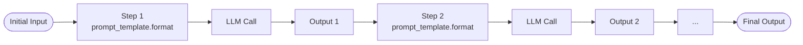

# Prompt Chaining — control flow

```mermaid
flowchart LR
    Input([Initial Input]) --> S1[Step 1\nprompt_template.format]
    S1 --> M1[LLM Call]
    M1 --> Out1[Output 1]
    Out1 --> S2[Step 2\nprompt_template.format]
    S2 --> M2[LLM Call]
    M2 --> Out2[Output 2]
    Out2 --> Dots[...]
    Dots --> Final([Final Output])
```

Each `Step` appends a `"reasoning"` entry to the `Trace`. The pipeline length
is fixed — unlike ReAct, there is no dynamic branching.
