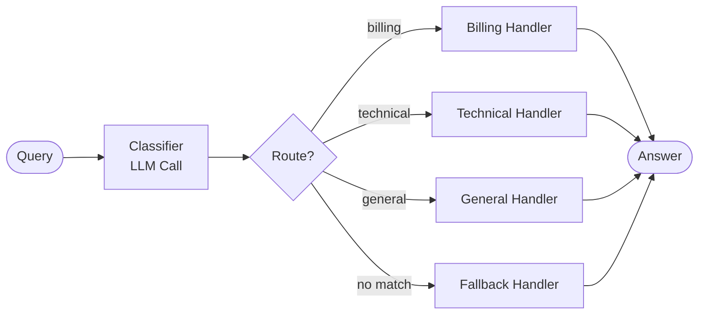

# Routing — control flow

The classifier makes a single LLM call and returns a route name. Dispatch is
deterministic — no further model calls. The cheapest useful agent shape and a
good baseline to benchmark richer patterns against.
