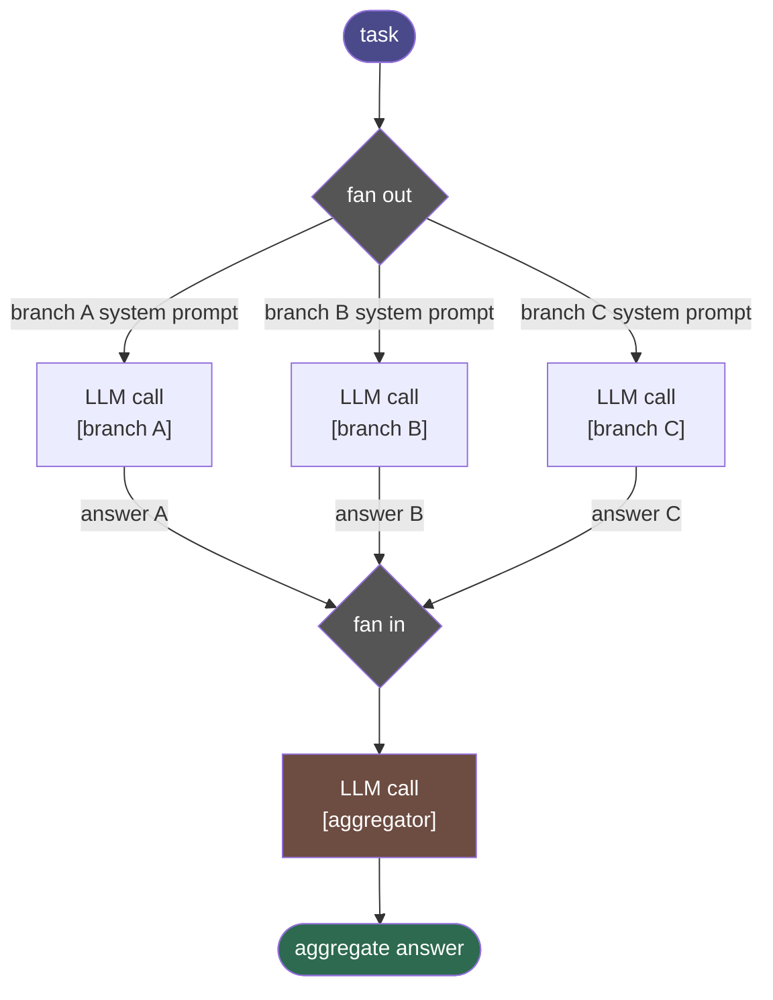

# Parallelization — control-flow diagram

## Step annotations

| Step kind   | When recorded                                      |
|-------------|----------------------------------------------------|
| `worker`    | Once per branch, after that branch's LLM call returns |
| `reasoning` | Once, after the aggregation LLM call completes     |
| `answer`    | Once, carrying the final synthesised text          |

## Threading model

All branch calls are submitted to a `ThreadPoolExecutor` before any result is
awaited. The executor size equals the number of branches, so every branch is
in-flight simultaneously. `concurrent.futures.as_completed` collects results as
they arrive and records each `worker` step in completion order (which may differ
from submission order). The aggregation call runs only after all branch futures
are resolved.
