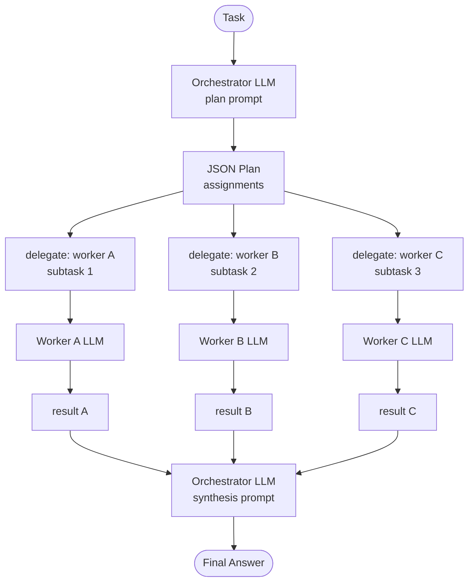

# Orchestrator-Workers — control flow

The orchestrator makes two LLM calls: one to produce the plan, one to
synthesize results. Each worker makes exactly one call and sees only its own
subtask — context remains small regardless of how many workers participate.

Unknown worker names in the plan are recorded as error trace steps and skipped;
the remaining assignments still execute normally.
