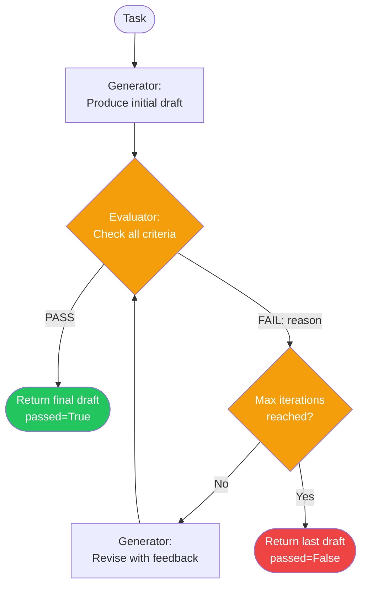

# Evaluator-Optimizer — Control-Flow Diagram

## Step legend

| Trace kind  | Description                                          |
|-------------|------------------------------------------------------|
| `reasoning` | Initial draft produced by the generator              |
| `critique`  | Evaluator verdict (`PASS` or `FAIL: <reason>`)       |
| `revision`  | Revised draft produced by the generator after a FAIL |
| `answer`    | Final output returned to the caller                  |
