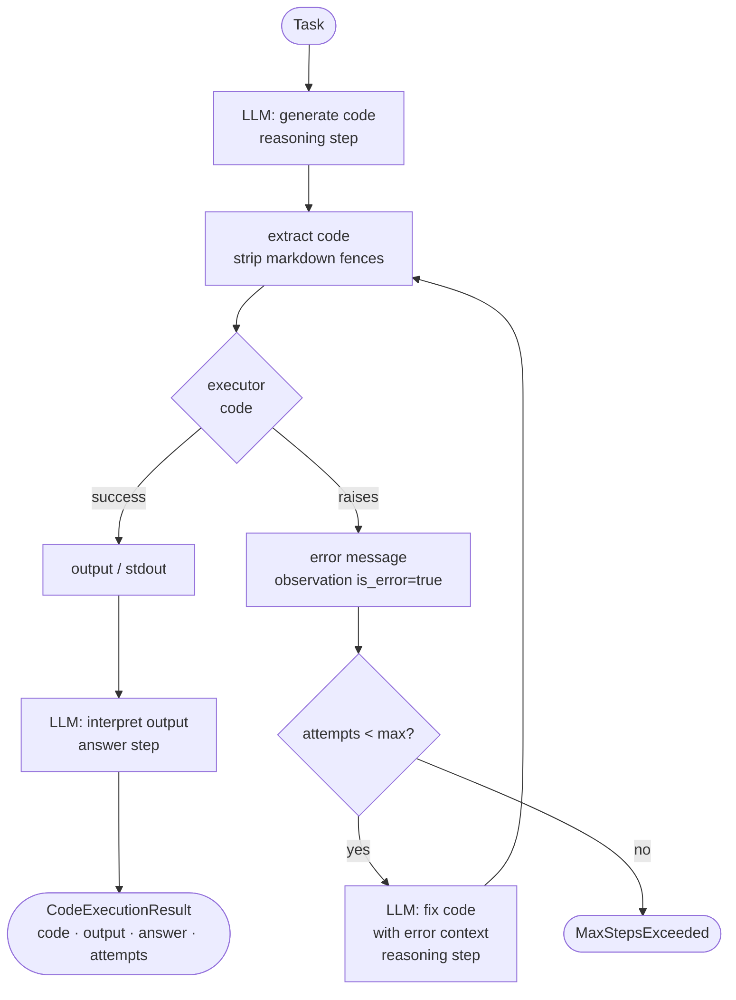

# Code Execution — control flow

Each code-generation call appends a `"reasoning"` step to the `Trace`.
Each executor result appends an `"observation"` step (with `is_error=True` on failure).
The final interpretation appends an `"answer"` step.
