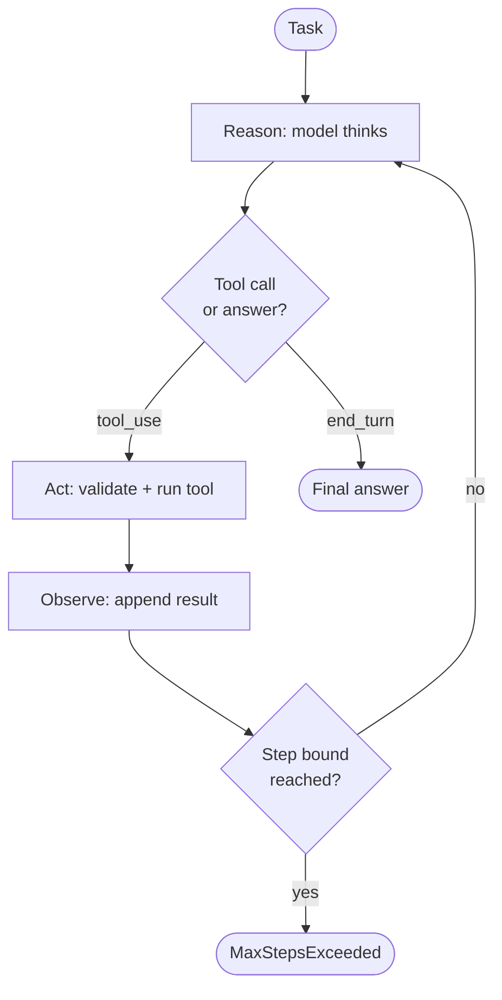

# ReAct — control flow

```mermaid
flowchart TD
    Start([Task]) --> Reason[Reason: model thinks]
    Reason --> Decide{Tool call<br/>or answer?}
    Decide -->|tool_use| Act[Act: validate + run tool]
    Act --> Observe[Observe: append result]
    Observe --> Bound{Step bound<br/>reached?}
    Bound -->|no| Reason
    Bound -->|yes| Fail([MaxStepsExceeded])
    Decide -->|end_turn| Answer([Final answer])
```

Every node above is recorded as a `Step` in the run's `Trace` with its
wall-clock duration, then rendered as the reasoning → tool → observation tree.
