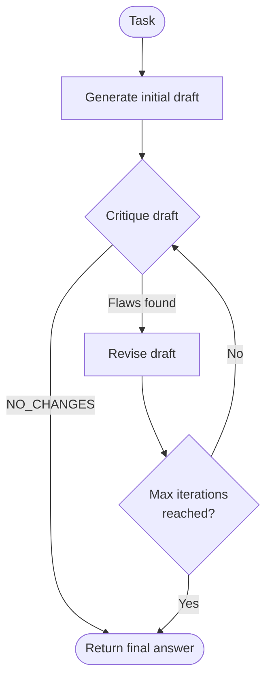

# Reflection — Control-Flow Diagram

## Notes

- **Single client**: the same model handles generation, critique, and revision.
- **Early exit**: the loop breaks as soon as the critique response starts with
  `NO_CHANGES` (case-insensitive), regardless of how many iterations remain.
- **Bounded loop**: `max_iterations` caps the number of critique-revision cycles
  (default 3); the initial draft generation does not count as an iteration.
- **Trace steps**: `reasoning` (initial draft), then alternating `critique` /
  `revision` steps, ending with an `answer` step.
