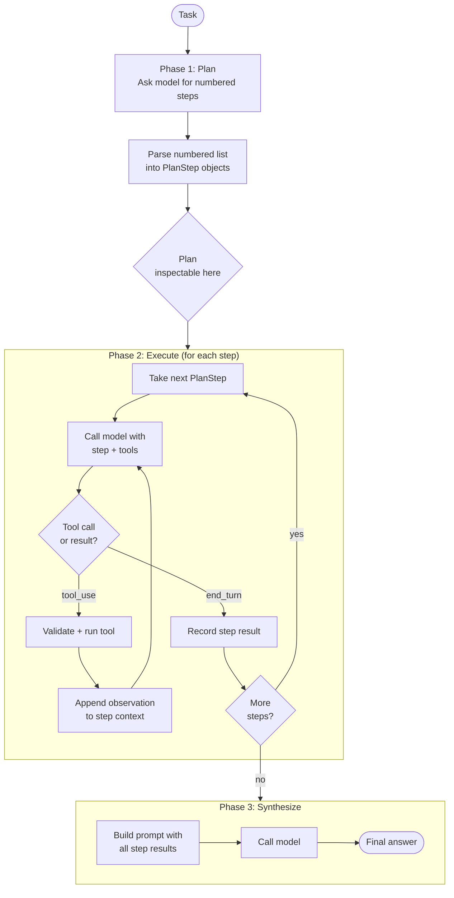

# Plan-and-Execute — control flow

Each step in the execution phase runs its own inner tool loop, identical to
ReAct's loop but scoped to one plan step. Tool calls and observations are
recorded as `Step` entries in the run's `Trace`. The plan itself is recorded
as a single `"plan"` step before execution begins.
