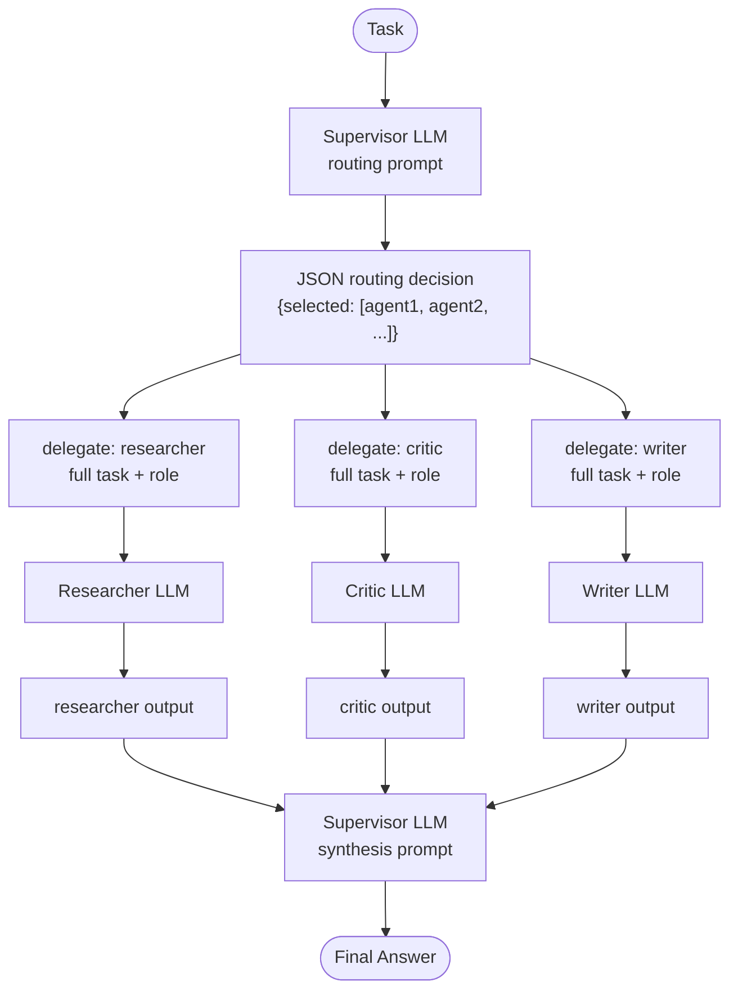

# Multi-Agent — control flow

The supervisor makes two LLM calls: one to produce the routing decision, one to
synthesize results. Each agent makes exactly one call and receives the full
task prefixed by their role description — every agent sees the whole problem
from their own perspective, not a fragment.

Unknown agent names in the routing decision are recorded as error trace steps
and skipped; the remaining selected agents still execute normally.
