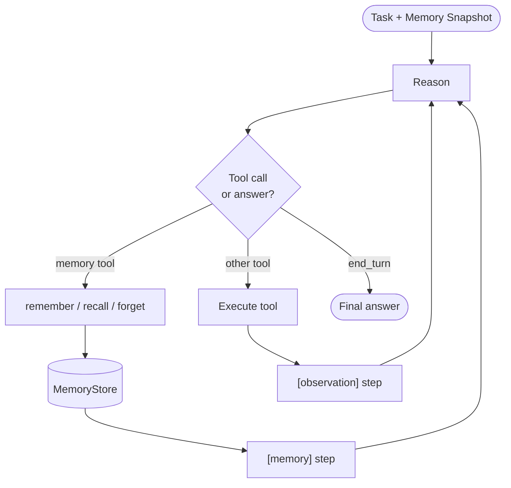

# Memory-Augmented Agent — control flow

Memory tool results are recorded as `"memory"` steps; ordinary tools as `"observation"` steps.
Both paths go through the same ReAct loop — the memory store persists across the run.
