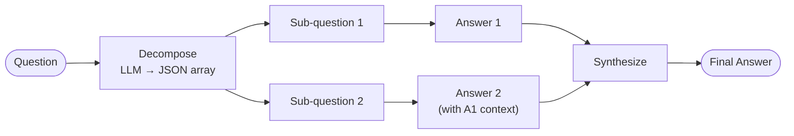

# Self-Ask — control flow

Three LLM call types: one decompose, one per sub-question (with prior answers in context), one synthesis.
The sub-questions are answered sequentially so each answer enriches the context for the next.
