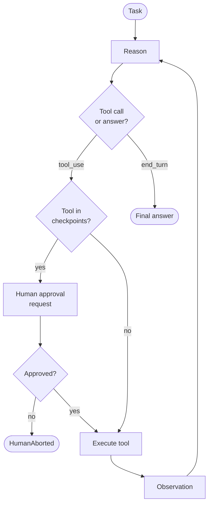

# Human-in-the-Loop — control flow

Non-checkpointed tools bypass the gate entirely; only tools whose names appear in `checkpoints`
pause for `HumanIO.request`. A rejection raises `HumanAborted` immediately.
