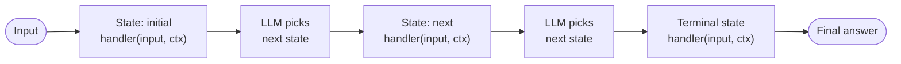

# State Machine Agent — control flow

Each non-terminal state's output is appended to `accumulated_context`; the LLM selects the
next transition from the state's `transitions` list. A terminal state (or empty transitions) ends the loop.
