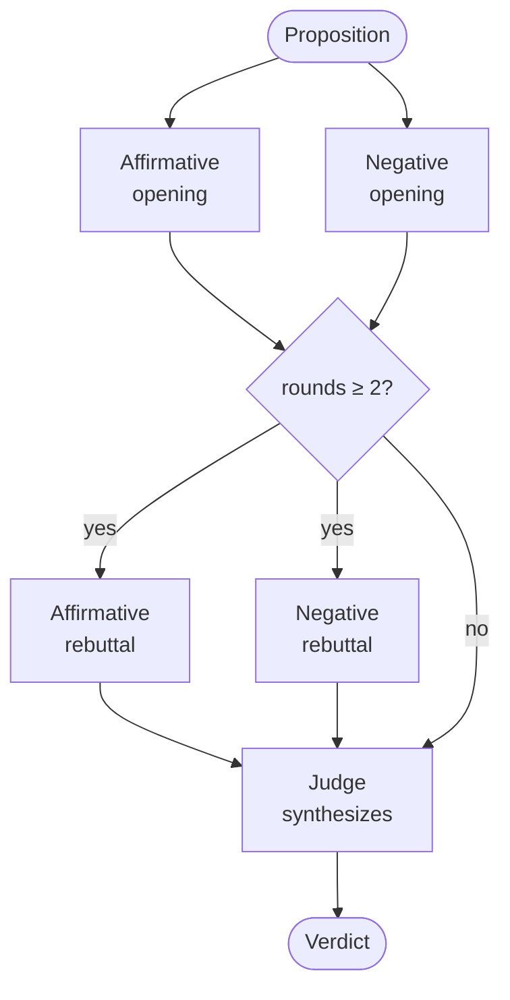

# Debate — control flow

```mermaid
flowchart TD
    P([Proposition]) --> Aff["Affirmative\nopening"]
    P --> Neg["Negative\nopening"]
    Aff & Neg --> R{"rounds ≥ 2?"}
    R -->|yes| AffR["Affirmative\nrebuttal"]
    R -->|yes| NegR["Negative\nrebuttal"]
    AffR & NegR --> Judge["Judge\nsynthesizes"]
    R -->|no| Judge
    Judge --> Verdict([Verdict])
```

Each agent call has its own isolated message list. With `rounds=1` only the opening arguments
are collected before the judge renders a verdict.
