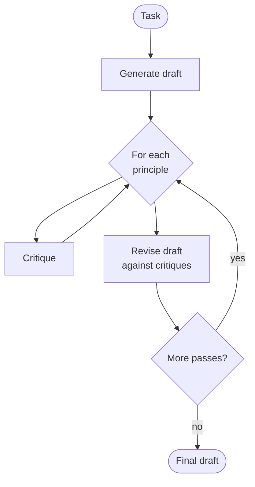

# Constitutional AI — control flow

The critique–revision loop repeats up to `max_revisions` times. If `principles` is empty the
initial draft is returned immediately without any critique or revision steps.
