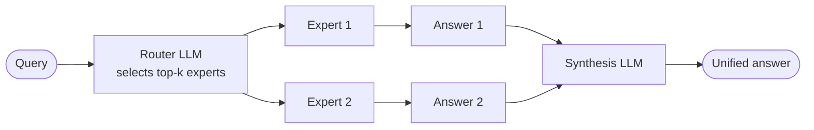

# Mixture-of-Experts — control flow

```mermaid
flowchart LR
    Q([Query]) --> Router["Router LLM\nselects top-k experts"]
    Router --> E1[Expert 1]
    Router --> E2[Expert 2]
    E1 --> A1[Answer 1]
    E2 --> A2[Answer 2]
    A1 & A2 --> Synth["Synthesis LLM"]
    Synth --> Final([Unified answer])
```

With `top_k=1` the single expert's answer is returned directly (no synthesis call).
Each expert uses its own system prompt and an independent message list.
