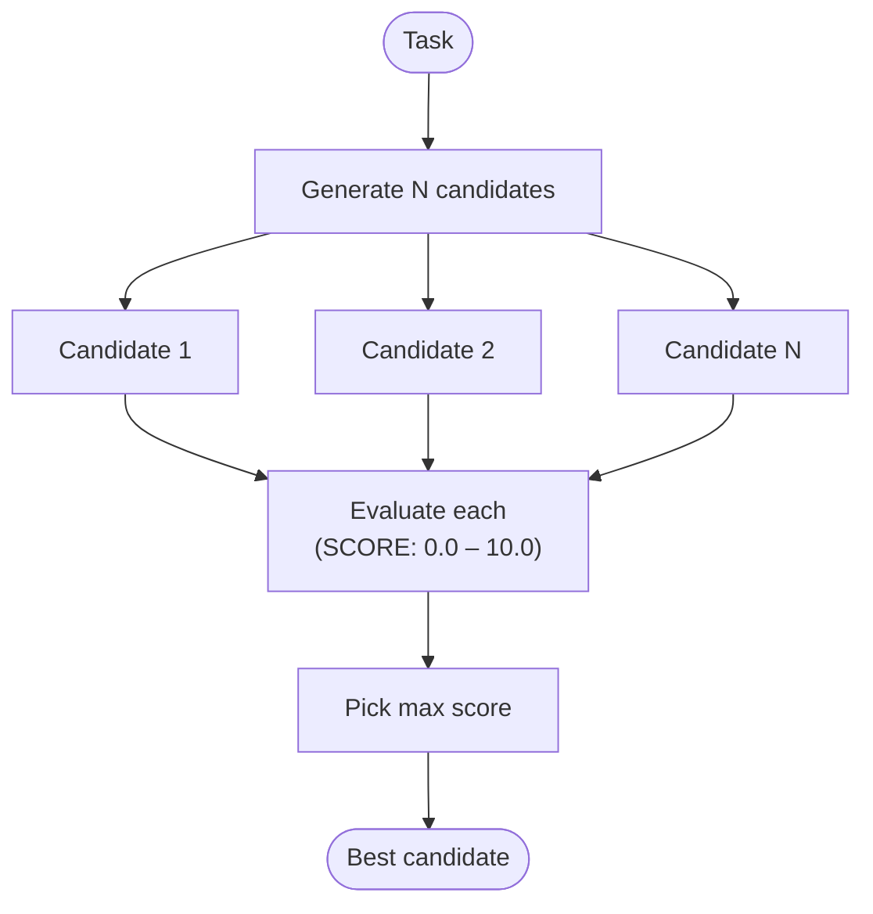

# Speculative Execution — control flow

With `n_candidates=1` the evaluation step is skipped; the single candidate scores 10.0.
Each candidate is generated independently (no shared context between generation calls).
