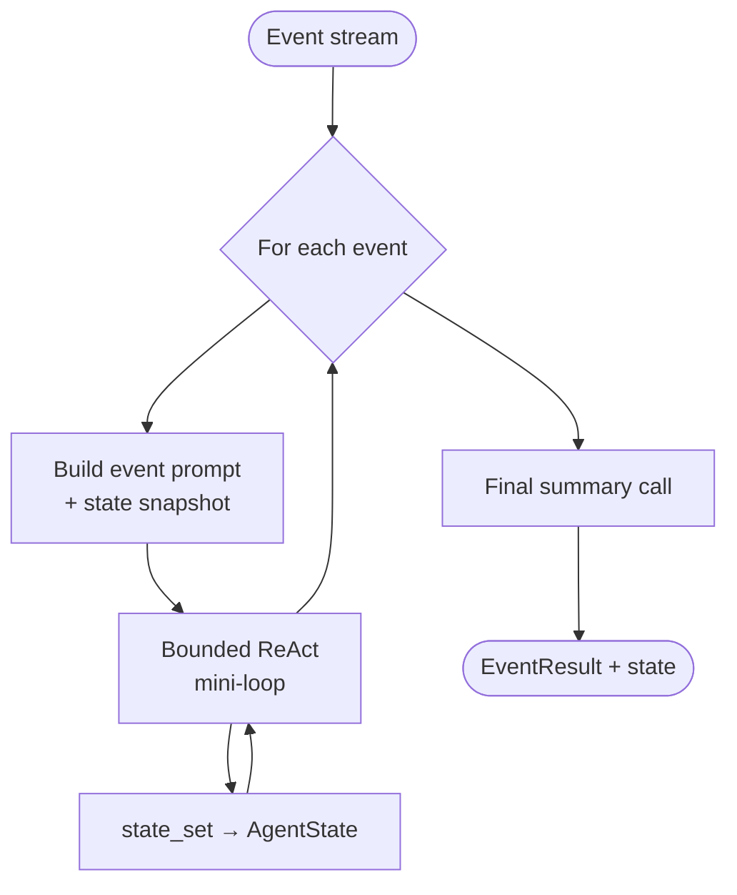

# Event-Driven Agent — control flow

The `state_set` tool is auto-registered alongside any caller-supplied tools. State persists
across all events in the run so the agent can correlate information between them.
