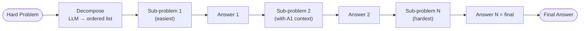

# Least-to-Most — control flow

Each sub-problem's solve prompt includes all prior Q&A pairs. The last sub-problem's answer
is returned as the final answer — it has access to all simpler building blocks.
